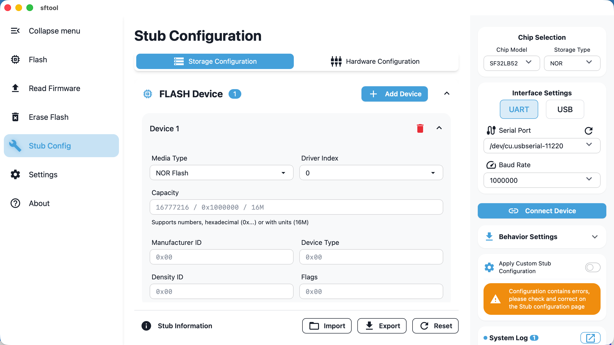
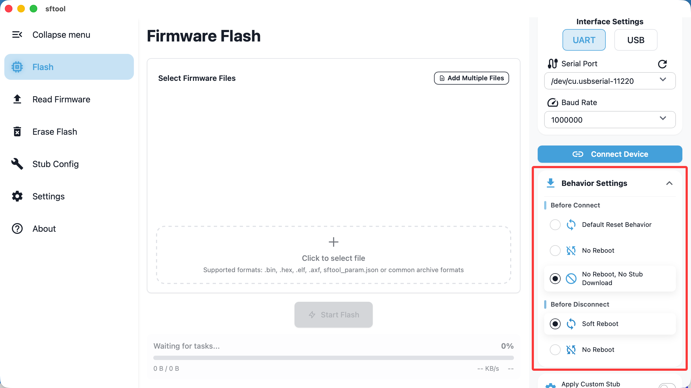

> sftool-gui provides advanced users with deep customization options, supporting
> custom hardware drivers and fine-grained control of connection behaviors.

## Stub Configuration

::: info stub Mechanism explanation During flashing, sftool first downloads a
small stub program into the device RAM. The host then interacts with this stub
to perform Flash read, erase, and write operations. :::

### Driver Injection and Hardware Initialization

The stub includes common Flash drivers. If your hardware uses non-standard or
newer Flash chips, you can inject external drivers manually:

- Flash devices: support adding up to 12 sets of custom Flash drivers; parameter
  configuration [reference link]{1}.

    1. For Flash Type configuration, please refer to [Flash Type
       Selection](https://wiki.sifli.com/tools/flash/Flash%E9%85%8D%E7%BD%AE%E6%8C%87%E5%8D%97.html#flash-type).

    2. For ChipID configuration, please refer to [How to Find
       ChipID](https://wiki.sifli.com/tools/flash/Flash配置指南.html#chipid).

    3. For flag configuration, please refer to [Configuring
       ext_flags](https://wiki.sifli.com/tools/flash/Flash配置指南.html#ext-flags).

- SDIO configuration: supports SDIO interface settings, suitable for eMMC or TF
  card storage.

- GPIO management: supports defining initial high/low states for up to 12 GPIOs.

- PMIC management: supports configuring SF30147 voltage rails to ensure stable
  operation during programming.

### Activation and Validation

Enable switch: after completing configuration, you must check the `Apply custom
settings` option on the right; otherwise the software will continue using the
built-in default stub.

Import/export: supports JSON format configuration files for easy parameter
migration between devices.

Validation: if entered parameters contain logical errors (e.g., invalid
formats), the `Apply custom settings` switch cannot be enabled.

## Behavior Settings

You can customize specific actions the tool performs when connecting or
disconnecting based on the hardware's real-time state.

### Before Connect

Determines what the tool does before attempting to download the stub:

1. Default Reset Behavior (default)

- Logic: send a reset command first, then download the stub.

- Scenario: suitable for devices in low-power (sleep) mode. In this state the
  chip may not respond to serial download commands and must be woken by a reset.

2. No reboot

Logic: Direct download of the stub and connection establishment without
performing a reset.

3. Logic: do not reset; directly attempt to download the stub and establish a
   connection.

- No reboot, no stub download

- Logic: directly establish a secondary connection to an existing stub in RAM.

### Before Disconnect

Determines the device state after operations finish and you click "Disconnect":

1. Soft reboot

- Logic: reset the chip immediately after disconnect.

- Result: the stub in RAM is lost and the chip begins running the user program
  from Flash. Usually chosen after firmware programming to take effect
  immediately.

2. No reboot (default)

- Logic: do not send a reset after disconnect.

- Result: the chip remains running the stub. Newly flashed firmware will not
  run, which is convenient for reconnecting and debugging without power-cycling.
