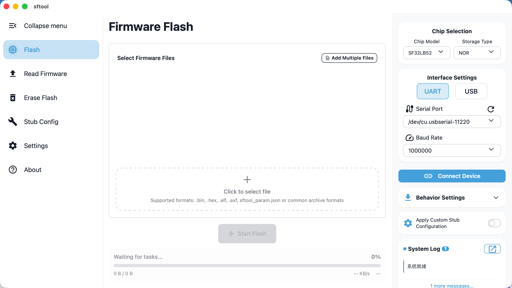

> A user-friendly graphical flashing tool for the SiFli family of chips.

## What is sftool-gui?

sftool-gui is a desktop application that provides a graphical interface for programming SiFli microcontrollers. The application removes the complexity of command-line tools with an intuitive UI, allowing users to flash firmware, read Flash memory, and erase Flash data with just a few clicks. Its target audience is SiFli embedded systems developers and hardware engineers who need an efficient flashing solution.

## Supported Devices and Hardware

sftool-gui supports a wide range of SiFli chips and memory configurations to flexibly meet different project needs.

### Supported Chip Models

| Chip Model | Supported Memory Types | Interface Options |
|:---------:|:---------------------:|:----------------:|
| SF32LB52  | NOR, NAND, SD         | UART             |
| SF32LB55  | NOR, SD               | UART             |
| SF32LB56  | NOR                   | UART, USB        |
| SF32LB58  | NOR                   | UART, USB        |

### Memory Types Overview

The application supports three main memory types, each optimized for different use cases:

- NOR Flash: fast random access, suitable for code execution and small data storage  
- NAND Flash: high-density storage for large data volumes at low cost  
- SD Card: removable storage for easy data logging and updates

All chip models support UART communication. Baud rates are configurable (1M, 1.5M, 3M, 6M) to integrate flexibly with existing development environments.

> During flashing, sftool first downloads a small stub program into the device RAM, then the host interacts with that stub to perform Flash read, erase, and write operations.
>
> The stub contains only a limited set of Flash drivers. If the Flash part in use is not included in the built-in driver library, an external Flash driver must be injected manually for proper operation.
>
> For instructions on injecting Flash drivers, see [stub configuration](/en/Feature/README.md#stub-configuration)