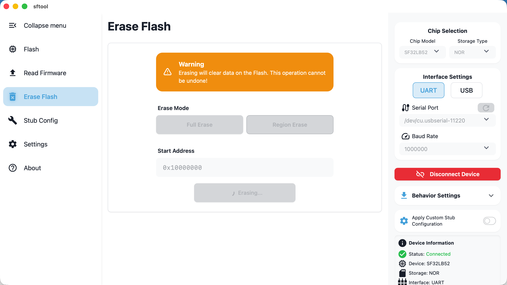

> This chapter explains how to erase data from memory using sftool-gui. Two modes are provided: full chip erase and area (sector) erase to meet different development needs.

::: caution
Erasing will clear data on the Flash. This operation cannot be undone!
:::

## Preparation

Before performing erase operations, ensure you have completed the following:

- Connection setup: For specific connection steps, refer to [Firmware Flashing -Flashing Preparation](/en/get-started/configureproject.md##flashing-preparation), configure the correct serial parameters, and successfully connect the device.

- Data confirmation: Confirm there is no important unbacked data in Flash before erasing.

## Configuration Options

You can choose one of the following erase modes as needed:

1. Full Erase:

- Removes all data on the Flash memory.

2. Region Erase:

- Operation: Manually enter the start address in hexadecimal.

- Range: Erases from the entered start address to the end of the Flash.

- Use cases: Commonly used to preserve the bootloader or Ftab sectors while deleting only the main application or subsequent data.

## Performing Erase

1. Start task: After confirming the mode and address, click the `Start Erase` button.

2. Wait: During the erase, the UI will display `Erasing...`.

- Note: Due to Flash hardware characteristics, erase operations (especially mass erase) may take a long time. Do not perform other operations or forcibly disconnect during the process to avoid hardware hangs or logical corruption.

3. Completion: When the `Start Erase` button becomes clickable again and the log panel shows success, the erase task is complete.