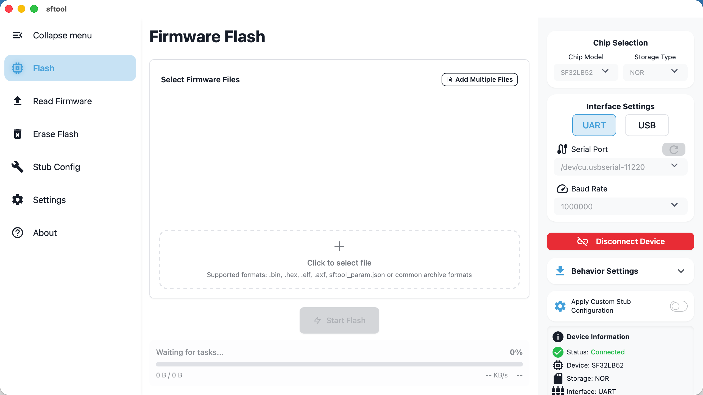
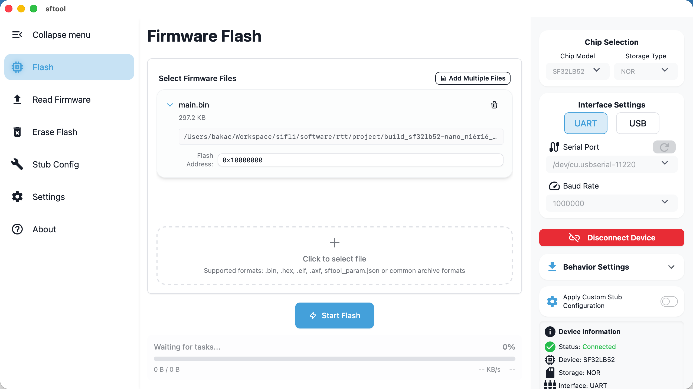
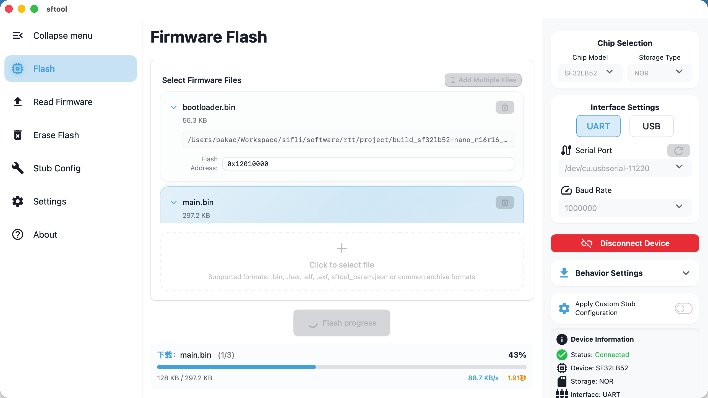
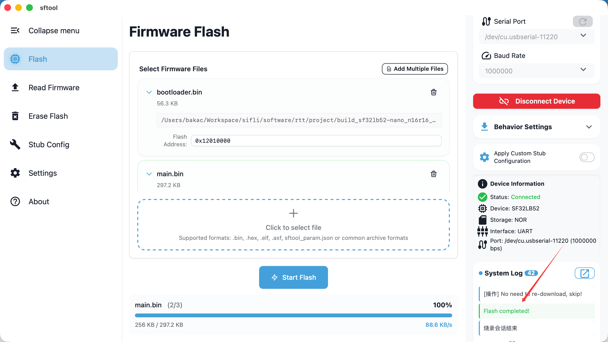

> This guide details the complete process of writing firmware to Flash in sftool-gui, covering device connection, firmware selection, and flashing execution.

## Flashing Preparation

Before starting the flashing process, ensure the hardware is connected properly and software parameters are correctly configured:

1. Start the software: open the `sftool-gui` application.

2. Configure the chip: in the `Chip Selection` area, accurately choose your target `chip model` and `memory type`.

3. Set the interface: in the `Interface Settings` area, select the `serial port` and `baud rate` corresponding to your hardware connection.

4. Establish connection: click the `Connect Device` button. Wait for the status bar to indicate a successful connection (as shown below).

## Selecting Firmware

`sftool-gui` supports various firmware formats and provides intelligent address parsing. Refer to the following instructions according to your file type:

### 1. Auto-configuration Mode (Recommended)

Use the following formats to automatically handle multi-file loading and address allocation—most convenient:
- `sftool_param.json` configuration file

    Note: The system will automatically populate Bootloader, Ftab, Main, and other binary files and their corresponding addresses based on the JSON configuration.

- `.zip` / `.rar` / `.7z` archives

    Note: Ensure the archive contains `sftool_param.json`. After importing, the software will automatically extract it to a temporary directory (cleaned on exit) and parse the configuration.

### 2. Automatic Address Detection

- `.hex` / `.elf` / `.axf` files

    Note: The software will automatically parse and fill in the flashing addresses.

### 3. Manual Address Configuration

- `.bin` raw binary files

    Note: After importing the file, you must manually enter the flashing address in the address field.

## Executing Flash

1. Start writing: after confirming files and configuration are correct, click the `Start Flash` button.

    Tip: During flashing, the row for the file currently being written will be highlighted.

2. Completion and Reset:

When the system log box displays `Flash completed!`, the operation is finished. You can then disconnect and reboot the device to apply the firmware.

