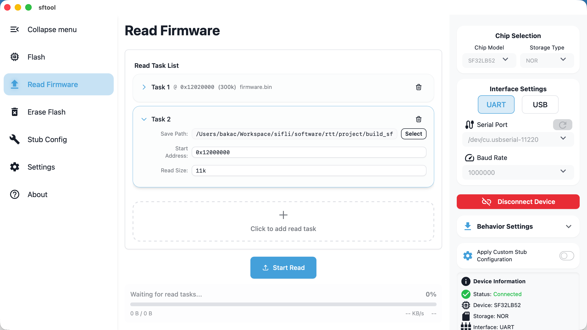
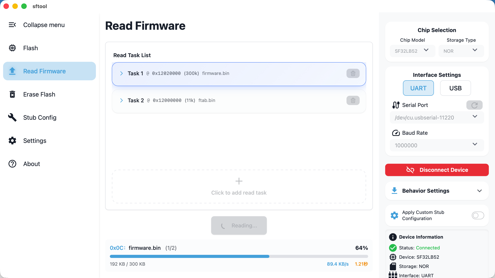
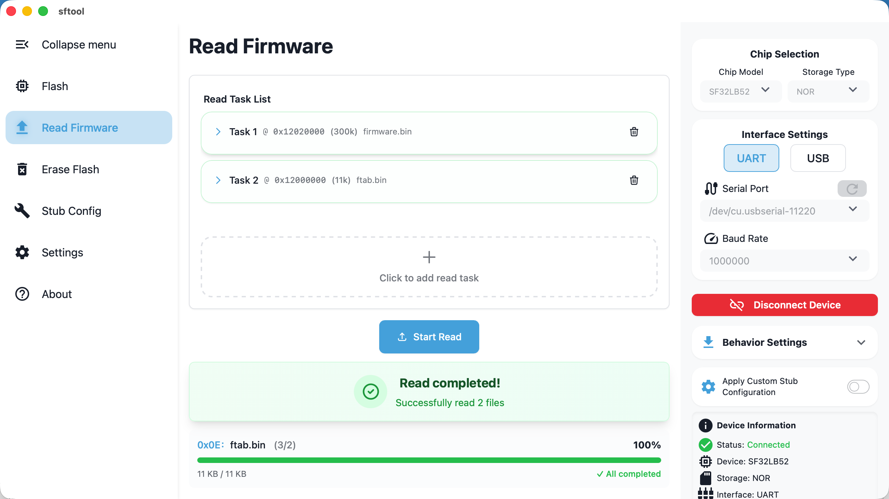

> This section explains how to read data from the device's Flash and export it to files, supporting multiple address ranges in one operation.

## Preparation

Before performing a read operation, ensure the device is connected. For connection steps, see [Firmware Flashing -Flashing Preparation](/en/get-started/configureproject.md##flashing-preparation). Complete the serial port and baud rate configuration and confirm the device is connected.

## Configure Read Tasks

1. Create a task: click the `Click to add read task` button — a new configuration row will appear in the task list.
2. Set parameters: set `Save Path`, `Start Address`, and `Read Size` in order.
3. Batch operations: you can add multiple tasks to read different address ranges in one run.

::: note About the "Read Size" format
- Hexadecimal: supports standard hex format (e.g., 0x1000).
- Decimal with units: supports k / m suffixes (case-insensitive).
- Note: do not add a trailing "b" to the unit (for example, 4k is correct; 4kb is incorrect).
:::

## Execute Reading

1. Start reading: after confirming all task configurations are correct, click the `Start Read` button.

    Tip: the row for the task currently being executed will be highlighted.

2. Complete reading: when the message `Reading completed!` appears, the data has been successfully saved to the specified path. You can safely disconnect or switch to another page.

