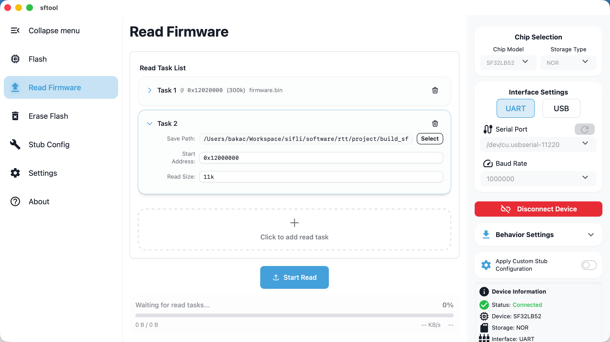
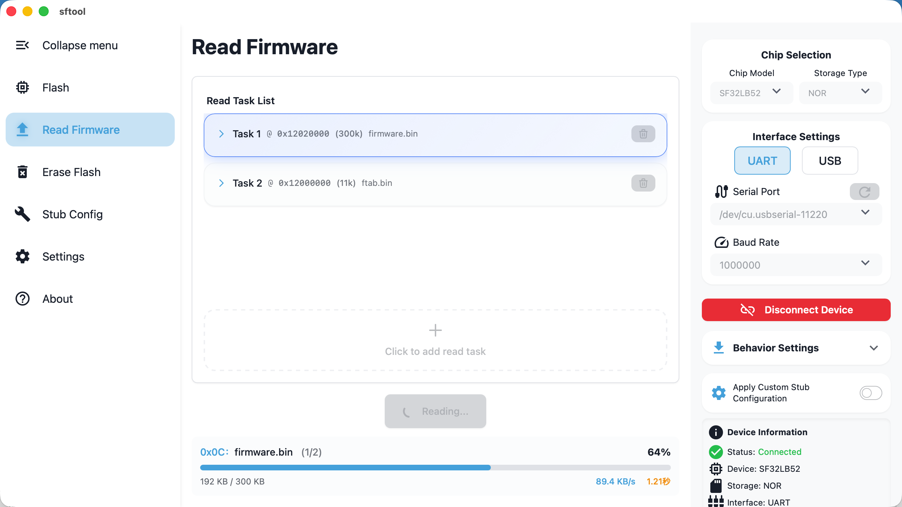
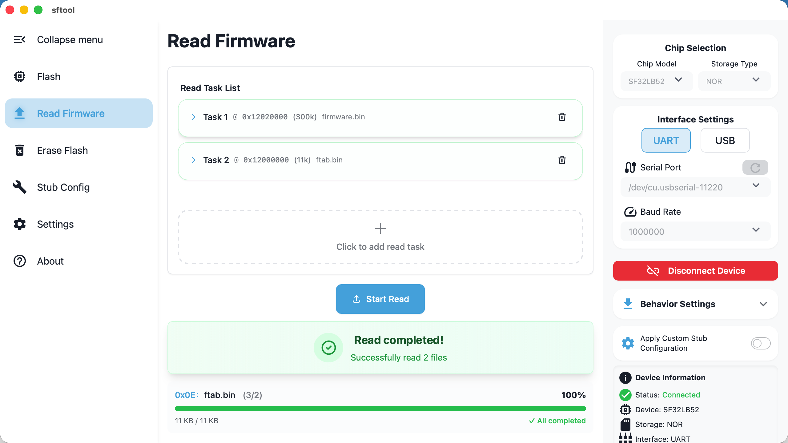

> This section explains how to read data from the device's Flash and export it
> to files, supporting multiple address ranges in one operation.

## Preparation

在执行读取操作前，请确保设备已连接。具体的连接步骤请参考 [烧录固件 -
烧录准备](/zh_CN/get-started/configureproject.md#烧录准备)章节，完成串口和波特率的配置并成功连接设备。

## Configure Read Tasks

1. Create a task: click the `Click to add read task` button — a new
   configuration row will appear in the task list.
2. Set parameters: set `Save Path`, `Start Address`, and `Read Size` in order.
3. Batch operations: you can add multiple tasks to read different address ranges
   in one run.

::: note About the "Read Size" format

- Hexadecimal: supports standard hex format (e.g., 0x1000).
- Decimal with units: supports k / m suffixes (case-insensitive).
- 注意：单位后缀不需要加 b（例如：填写 4k 是正确的，填写 4kb 是错误的）。

:::

## Execute Reading

1. Start reading: after confirming all task configurations are correct, click
   the `Start Read` button.

   Tip: the row for the task currently being executed will be highlighted.

2. Complete reading: when the message `Reading completed!` appears, the data has
   been successfully saved to the specified path. You can safely disconnect or
   switch to another page.

