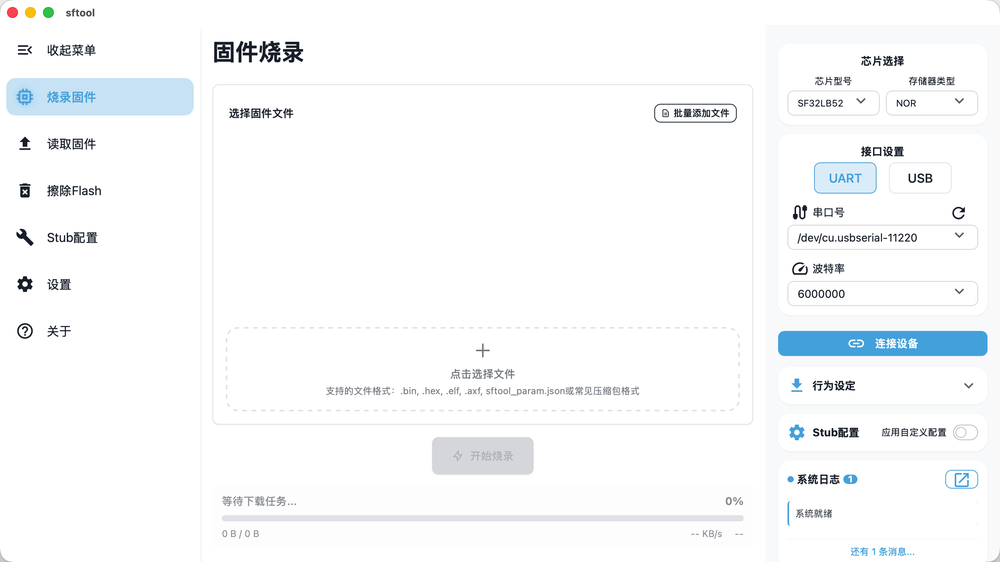

 > sftool-gui 是一款用户友好的 SiFli 系列芯片图形化烧录工具。基于 Tauri + Vue 3 + TypeScript 构建，通过直观的界面简化了固件烧录流程，支持多种芯片型号、存储器类型以及全面的日志记录功能。

 ## 什么是 sftool-gui？

sftool-gui 是一个桌面应用程序，作为 SiFli 微控制器编程的图形界面。该应用通过直观的界面消除了命令行工具的复杂性，用户只需点击几下即可烧录固件、读取 Flash 内存和擦除 Flash 数据。它的目标受众是需要高效烧录解决方案的 SiFli 嵌入式系统开发者和硬件工程师。

## 支持的设备和硬件

sftool-gui 支持全面的 SiFli 芯片和存储器配置，能够灵活满足不同的项目需求。

### 支持的芯片型号

| 芯片型号 | 支持的存储器类型 |	接口选项 |
|:-------:|:-------------:|:-------:|
|SF32LB52 |	NOR, NAND, SD |UART|
|SF32LB55 |	NOR, SD      |UART|
|SF32LB56 |	NOR|	UART, USB|
|SF32LB58 |	NOR|	UART, USB|

### 存储器类型概览

应用支持三种主要存储器类型，每种都针对不同用例进行了优化：

**NOR Flash**：快速随机访问，适用于代码执行和小数据存储
**NAND Flash**：高密度存储，适合大数据量的低成本方案
**SD 卡**：可移动存储，便于数据记录和更新
所有芯片型号均支持 UART 接口通信，波特率可配置（1M, 1.5M, 3M, 6M），以便灵活地与现有开发环境集成。

> sftool 在烧录过程中会先将一段 Stub 程序下载至设备 RAM，随后由上位机与该 Stub 进行交互，以完成 Flash 的读取、擦除与写入操作。
>
> Stub 中仅内置有限数量的 Flash 驱动。当所使用的 Flash 颗粒未包含在内置驱动库中时，必须手动注入外部 Flash 驱动才能正常工作。
>
> 有关注入Flash驱动的说明，请参见[Stub配置]