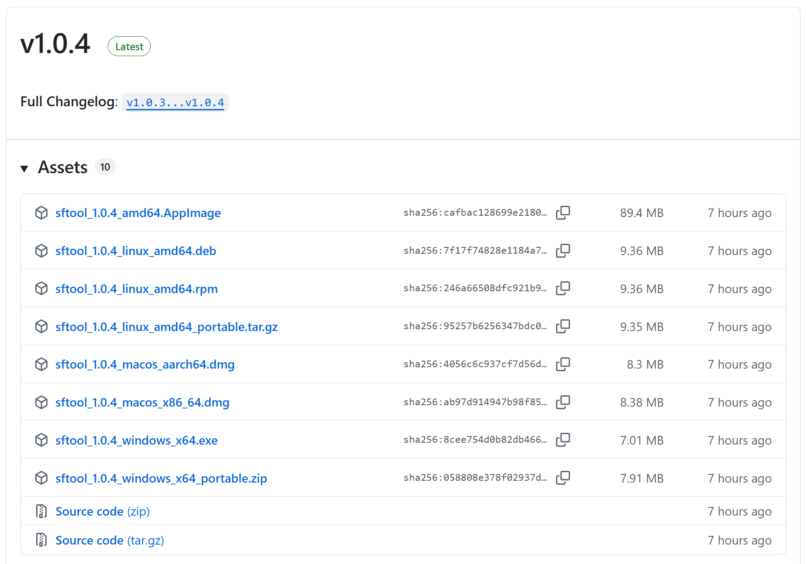
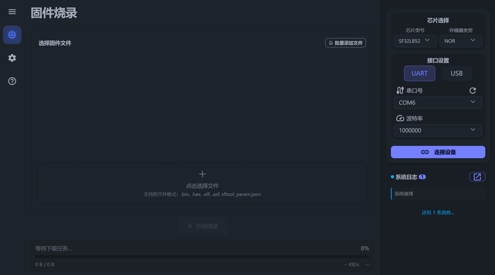
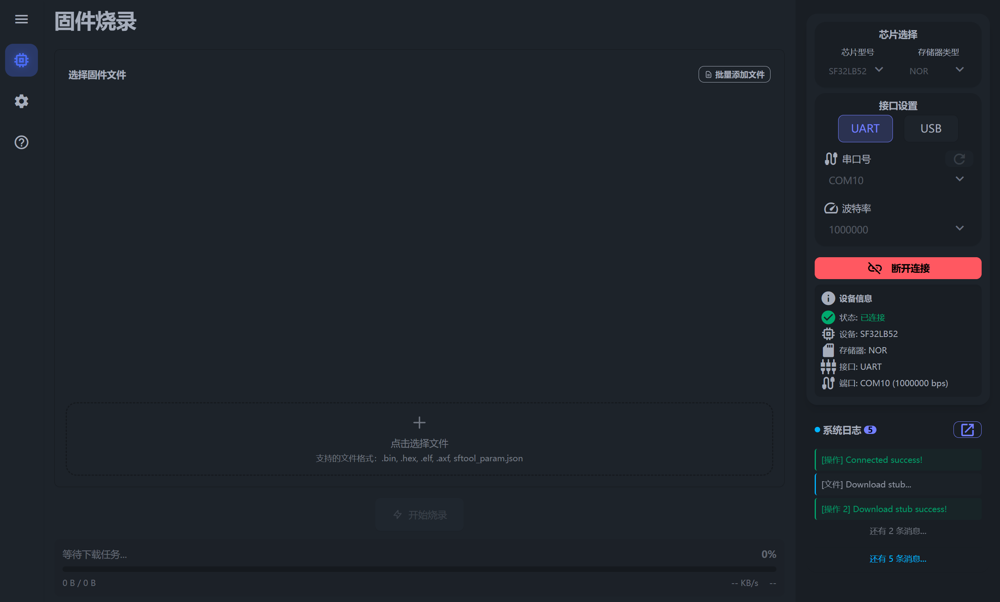
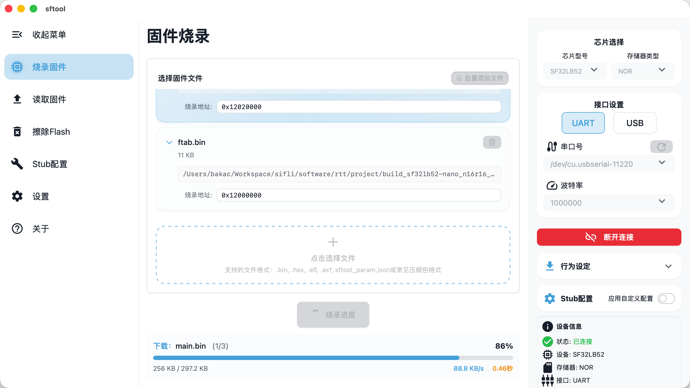
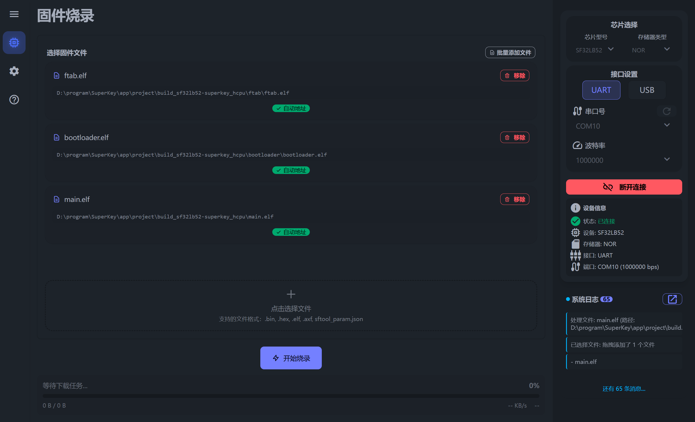

> 本指南详细说明了在 sftool-gui 中将固件写入 Flash 的完整操作流程，涵盖设备连接、固件选择及烧录执行。

## 烧录准备

在开始烧录前，请确保硬件连接正常并正确配置软件参数：

1. **启动软件**：打开 `sftool-gui` 应用程序。

2. **配置芯片**：在 `芯片选择` 区域，准确选择您的目标 `芯片型号` 和 `存储器类型`。

3. **设置接口**：在 `接口设置` 区域，选择硬件连接对应的 `串口号` 及 `波特率`。

4. **建立连接**：点击 `连接设备` 按钮。等待状态栏提示连接成功（如下图所示）。

## 选择固件

`sftool-gui` 支持多种固件格式，并提供智能化的地址解析功能。请根据您的文件类型参考以下说明：

### 1. 自动配置模式（推荐）

使用以下格式可自动完成多文件加载与地址分配，最为便捷：
- `sftool_param.json` 配置文件

    **说明**：系统将根据 JSON 配置自动填入 Bootloader、Ftab、Main 等二进制文件及其对应地址。

- `.zip` / `.rar` / `.7z` 压缩包

    **说明**：请确保压缩包内包含 `sftool_param.json`。导入后，软件会自动解压至临时目录（退出程序时自动清理）并解析配置。

### 2. 自动地址识别

- `.hex` / `.elf` / `.axf` 文件

    **说明**：软件会自动解析并填入烧录地址。

### 3. 手动地址配置

- `.bin` 纯二进制文件

    **说明**：导入文件后，必须手动填写烧录地址框。

## 执行烧录

1. **开始写入**：确认文件和配置无误后，点击 `开始烧录` 按钮。

    **提示**：烧录过程中，当前正在写入的文件行会高亮显示。

2. **完成与复位**：

当系统日志框显示 `烧录完成` 字样时，表示操作结束。此时可以断开连接，重启设备使固件生效。

