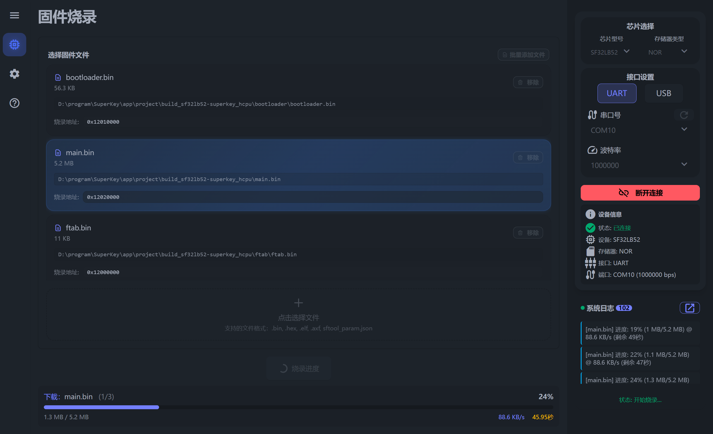

> 本章节介绍如何从设备的 Flash 中读取数据并导出为文件，支持多段地址同时读取。

## 准备工作

在执行读取操作前，请确保设备已连接。具体的连接步骤请参考[烧录固件 - 烧录准备](/get-started/configureproject.md#烧录准备)章节，完成串口和波特率的配置并成功连接设备。

## 配置读取任务

1. **新建任务**：点击 `添加读取任务` 按钮，任务列表中将生成一行新的配置项。
2. **参数设置**：依次设置`保存路径`、`起始地址`和`读取大小`。
3. **批量操作**：支持添加多个任务，一次性读取不同地址段的数据。

::: note 关于“读取大小”的格式说明
- 十六进制：支持标准 Hex 格式（例如 0x1000）。
- 带单位十进制：支持 k / m 等单位后缀（大小写不敏感）。
- 注意：单位后缀不需要加 b（例如：填写 4k 是正确的，填写 4kb 是错误的）。
:::

## 执行读取

1. **开始读取**：确认所有任务配置无误后，点击 `开始读取` 按钮。

    **提示**：读取过程中，当前正在执行的任务行会高亮显示。

2. **完成读取**：当提示 `读取完成` 字样时，表示数据已成功保存至指定路径。此时您可以安全断开连接，或切换到其他功能页面进行操作。

