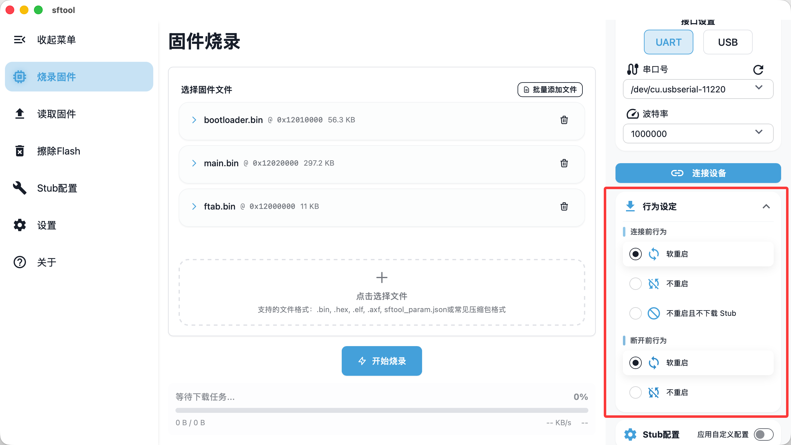

> sftool-gui 为高级用户提供了深度定制选项，支持自定义硬件驱动及复杂的连接行为控制。

## stub配置

::: info stub 机制说明
sftool 在烧录过程中会先将一段 stub 程序下载至设备 RAM，随后由上位机与该 stub 进行交互，以完成 Flash 的读取、擦除与写入操作。
:::

### 驱动注入与硬件初始化

stub 内置了主流 Flash 驱动。若您的硬件使用了非标准或较新的 Flash 颗粒，需通过此功能手动注入外部驱动：

- Flash 设备：支持额外添加最多 12 组自定义 Flash 驱动。

    1. Type的配置，请参考[Flash Type选择](https://wiki.sifli.com/tools/flash/Flash%E9%85%8D%E7%BD%AE%E6%8C%87%E5%8D%97.html#flash-type)

    2. ChipID的配置，请参考[查找ChipID方法](https://wiki.sifli.com/tools/flash/Flash配置指南.html#chipid)

    3. 标志的配置，请参考[配置ext_flags方法](https://wiki.sifli.com/tools/flash/Flash配置指南.html#ext-flags)

- SDIO 配置：支持 SDIO 接口配置，适用于 EMMC 或 TF 卡存储介质。

- GPIO 管理：支持定义最多 12 条 GPIO 的高低电平初始化状态。

- PMIC 管理：支持设置 SF30147 电压轨，确保硬件在烧录电压下稳定工作。

### 生效与校验

启用开关：完成配置后，必须在右侧勾选 `应用自定义设置`，否则软件将继续调用内置默认 stub。

配置导入/导出：支持 JSON 格式的配置文件，便于在不同设备间迁移参数。

校验机制：若填写的参数存在逻辑错误（如格式非法），`应用自定义设置` 开关将无法开启。

## 行为设定

您可以根据硬件的实时状态，自定义工具在连接与断开时的特定动作。

### 连接前行为

决定工具在尝试下载 stub 之前的动作：

1. 重启（默认选项）

- 逻辑：先发送复位指令，再执行 stub 下载。

- 场景：适用于设备处于低功耗模式（睡眠）的情况。此时芯片不响应串口下载指令，必须通过复位将其唤醒。

2. 不重启

逻辑：不执行复位动作，直接尝试下载 stub 并建立连接。

3. 不重启且不下载 stub

- 逻辑：直接与内存中已有的 stub 建立二次连接。

- 场景：极速连接模式。若上次断开连接时未重启设备，stub 仍驻留在 RAM 中，开启此项可大幅缩短连接耗时。

### 断开前行为

决定操作完成并点击“断开连接”后的设备状态：

1. 软重启

- 逻辑：断开后立即复位芯片。

- 结果：RAM 中的 stub 会丢失，芯片开始运行 Flash 中的用户程序。固件烧录后通常选择此项以立即生效。

2. 不重启（默认选项）

- 逻辑：断开后不发送复位信号。

- 结果：芯片继续保持在 stub 运行状态。此时新烧录的固件不会运行，方便您在不断电的情况下进行二次连接调试。